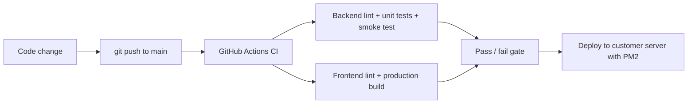
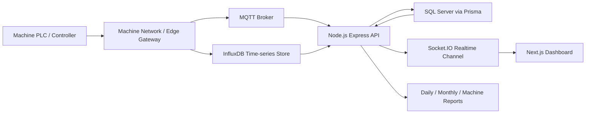

# Smart Factory MMS Dashboard

[](https://github.com/apiwatapply-svg/MMS_project/actions/workflows/ci.yml)

Smart Factory MMS Dashboard is a machine monitoring and OEE reporting platform for factory production lines. The system collects machine data from shop-floor networks, stores normalized production data in SQL Server, and presents real-time dashboards, daily reports, monthly reports, machine reports, NG reports, and operator working history.

## Project Highlights

- Monitors 207 active machines across 27 machine types and multiple factory areas.
- Connects machine-side data through MQTT, InfluxDB, SQL Server, and Socket.IO.
- Provides real-time machine status, output, target, cycle time, availability, performance, quality, and OEE views.
- Supports daily and monthly report dashboards for production decision-making.
- Includes PM2 deployment workflow for customer on-premise servers.
- Includes CI workflow for backend unit tests and frontend build verification.

## CI/CD Summary

Every push to `main` automatically runs GitHub Actions. The pipeline proves that the code can install dependencies, generate Prisma Client, pass backend tests, pass simulator tests, start the backend health endpoint, lint the frontend, and build the Next.js production output.



Use this when explaining the project in an interview:

- `CI`: checks code quality and prevents broken OEE/report/dashboard logic from being pushed unnoticed.
- `Smoke test`: starts the real Express server with machine I/O disabled and verifies `/api/health`.
- `CD approach`: after CI passes, build the frontend, install backend dependencies, generate Prisma Client, then restart the PM2 process on the customer server.
- `SSH deployment`: when deployment secrets are configured, GitHub Actions connects to the customer server over SSH and runs `scripts/deploy_pm2.sh`.

## Architecture Flow



## Main Modules

- `backend/`: Express API, Socket.IO, Prisma SQL Server integration, MQTT/Influx services, cron jobs, reports, and unit tests.
- `fontend/`: Next.js dashboard UI. The folder name is kept as-is to match the existing project.
- `docs/`: PRD, architecture document, user manual, workflow notes, and portfolio diagrams.
- `.github/workflows/ci.yml`: CI pipeline for tests and build.
- `ecosystem.config.js`: PM2 production process configuration.

## Local Setup

1. Install backend dependencies.

```bash
cd backend
npm install
```

2. Configure SQL Server and machine data connections.

```bash
cp .env.example .env
```

Update `DATABASE_URL`, MQTT, InfluxDB, and other environment values in `backend/.env`.

3. Generate Prisma client.

```bash
npx prisma generate
```

4. Run backend.

```bash
npm run test
node server.js
```

5. Run frontend.

```bash
cd ../fontend
npm install
npm run dev
```

## Seed Portfolio Demo Data

The seed script inserts realistic mock production data into the configured SQL Server database for all active machines, covering May 2026 through June 2026.

```bash
cd backend
node scripts/seed_portfolio_may_jun_2026.js
```

To preview without writing:

```bash
node scripts/seed_portfolio_may_jun_2026.js --dry-run
```

## Live MQTT / InfluxDB Demo Simulator

For an interview or local demo, MMS can run with live machine-style data instead of static report data.

1. Start MQTT broker and InfluxDB 1.x locally or point `.env` to existing services.

```env
ENABLE_MACHINE_IO=true
ENABLE_CRON_WORKER=false
MQTT_URL="mqtt://127.0.0.1:1883"
INFLUX_HOST="127.0.0.1"
INFLUX_PORT="8086"
INFLUX_DATABASE="machine_db"
INFLUX_URL="http://127.0.0.1:8086"
```

2. Install Python 3.11+ if it is not available. Installing `paho-mqtt` is optional because the simulator can fallback to the installed Mosquitto `mosquitto_pub.exe`.

```bash
cd backend
py -m pip install -r scripts/requirements-simulator.txt
```

3. Start the backend with machine I/O enabled.

```bash
node server.js
```

Keep `ENABLE_CRON_WORKER=false` for a live demo when you only need MQTT, InfluxDB, Socket.IO, and current-hour machine memory. Set it to `true` only when SQL Server credentials are ready and you want InfluxDB-to-SQL backfill jobs.

4. In another terminal, publish simulated machine data from 5-10 machine types.

```bash
npm run sim:mqtt -- --types 8 --interval 1 --cycles 120
```

Use `--cycles 0` for continuous mode, or `--no-influx` if you only want MQTT memory updates. The simulator publishes `data_tb`, `status_tb`, and `alarm_tb` payloads under `factory/{type}/{machine}/{measurement}` and writes the same records to InfluxDB line protocol so current-hour dashboard data can be queried.

The simulator is target-aware. It calculates output rate from `Run_Time x Performance / Ideal CT`, calculates hourly target from `(3600 - planned stop seconds) / Ideal CT x target efficiency`, and exposes scenarios such as `stable`, `downtime`, `quality_issue`, `planned_stop`, and `alarm`.

To control scenarios from a small Python dashboard:

```bash
npm run sim:dashboard
```

Open `http://127.0.0.1:5088`, choose the scenario, machine count, interval, Availability, Performance, Quality, and planned stop seconds/hour, then start or stop the simulation.

The dashboard also supports per-machine controls. Each machine can be enabled/disabled and assigned its own status, send interval, Availability, Performance, and Quality. Forced non-running statuses such as `Plan_Stop`, `Stop_Time`, `MC_Alarm`, and `Break_Time` do not emit output records; only `Run_Time` produces `data_tb` output based on accumulated runtime and ideal cycle time.

## Demo MSSQL Data

Historical demo data is kept in MSSQL only up to the current date. Use this when the dashboard needs yesterday/current-day plan, target, actual, CT, NG, runtime, availability, and OEE rows before the live MQTT simulator starts.

```bash
cd backend
npm run seed:demo -- --fill-missing-only
```

For startup mode, which checks yesterday and today only:

```bash
npm run seed:demo:startup
```

To run this automatically when `server.js` starts, set:

```env
DEMO_AUTO_SEED_MSSQL=true
```

The seed respects the main data invariants: `output = ok + ng`, `ng <= output`, output follows runtime and CT, planned-stop time is excluded from operating time, and OEE is derived from Availability, Performance, and Quality rather than random values.

## Tests

```bash
cd backend
npm test
npm run test:sim
```

Current unit tests cover OEE calculation rules, hourly aggregation, actual output selection, monthly report bucket logic, and simulator target/OEE formulas.

To run the same local CI flow with one command:

```bash
bash scripts/run_ci.sh --skip-install
```

The script creates local reports in `reports/`:

```text
reports/ci-report-YYYYMMDD-HHMMSS.md
reports/ci-log-YYYYMMDD-HHMMSS.txt
```

## Production Deployment with PM2

```bash
npm install -g pm2
pm2 start ecosystem.config.js
pm2 save
pm2 startup
```

The backend serves the exported Next.js frontend from `fontend/out` in production.

For SSH-based CD from GitHub Actions, configure the repository secrets in [PM2 Deployment Guide](docs/PM2_DEPLOYMENT.md), then push to `main`. CI must pass before the deploy job runs.

## Documentation

- [PRD](docs/PRD.md)
- [System Architecture](docs/System-Architecture.md)
- [User Manual](docs/User-Manual.md)
- [Git and DevOps Workflow](docs/Git-DevOps-Workflow.md)
- [CI Workflow](docs/CI_WORKFLOW.md)
- [PM2 Deployment Guide](docs/PM2_DEPLOYMENT.md)
