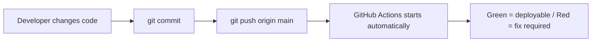

# MMS Dashboard CI Workflow

This project uses GitHub Actions to check the application before merge or deployment.

GitHub Actions uses a dummy `DATABASE_URL` only to generate Prisma Client and load backend modules during tests. It does not connect to the real customer SQL Server in CI.

## Automatic Trigger

CI runs automatically when code is pushed to `main` or when a pull request targets `main`.



For this repository, the Actions page is:

```text
https://github.com/apiwatapply-svg/MMS_project/actions
```

The badge in `README.md` shows the latest CI status. Green means the latest `main` commit passed the required checks.

## Recommended Branch Protection

For a stricter team workflow, enable branch protection on GitHub:

1. Open `Settings > Branches`.
2. Add a rule for `main`.
3. Enable `Require status checks to pass before merging`.
4. Select `MMS Dashboard CI / test-and-build`.
5. Enable `Require branches to be up to date before merging`.

After this, code cannot be merged into `main` unless CI passes.

## CI Steps

1. Checkout source code.
2. Install backend dependencies with `npm ci`.
3. Generate Prisma client with `npm run prisma:generate`.
4. Run backend syntax check with `npm run lint`.
5. Run backend unit tests with `npm test`.
6. Run machine simulator tests with `npm run test:sim`.
7. Run backend smoke test with `npm run smoke`.
8. Install frontend dependencies with `npm ci`.
9. Run frontend lint with `npm run lint`.
10. Build the frontend with `npm run build`.

## Why These Steps Matter

- Backend syntax check catches broken JavaScript before runtime.
- Prisma generate ensures `@prisma/client` is ready after dependency install.
- Unit tests protect OEE, output, machine status, report, auto NG, and display logic.
- Simulator tests protect target-aware machine simulation rules such as cycle time, planned stop, preventive, QC, and NG caps.
- Smoke test starts the API with machine I/O disabled and verifies `/api/health`.
- Frontend lint catches Next.js and React code quality issues inside `src`.
- Frontend build catches TypeScript and Next.js production build problems.

## Interview Explanation

Use this short story:

1. I push code to `main`.
2. GitHub Actions installs backend dependencies exactly from `package-lock.json`.
3. Prisma Client is generated from the schema so the backend can load database models.
4. Backend syntax and unit tests validate OEE, target, NG, report, simulator, and display rules.
5. A smoke test starts the real API with MQTT/Influx/cron disabled and checks `/api/health`.
6. Frontend dependencies are installed, lint runs, and Next.js production build must succeed.
7. If any step fails, deployment stops. If all steps pass, the commit is ready for PM2 deployment.

## Frontend Lint Policy

Frontend lint is scoped to `src` with:

```bash
npm run lint
```

It is now a required CI gate. The project still contains historical frontend debt, so the current ESLint policy disables rules that require larger refactors first, such as `any`, unused variables, and hook dependency warnings. Keep this gate enabled, then clean and re-enable stricter rules page by page.

## Local CI Commands

Run these before pushing. This is the same check order as GitHub Actions.

```bash
cd C:/Users/FDB-MM-024/Documents/My_Project/Apply_Job/Portfolio/MMS_project/backend
npm ci
npm run prisma:generate
npm run lint
npm test
npm run test:sim
npm run smoke

cd ../fontend
npm ci
npm run lint
npm run build
```

## What To Run Manually

If you want to run the full local CI with one command, use:

```bash
bash scripts/run_ci.sh
```

If dependencies are already installed and you do not want the script to clean/reinstall `node_modules`, use:

```bash
bash scripts/run_ci.sh --skip-install
```

In `--skip-install` mode, the script also skips `prisma generate` when an existing Prisma client is already present. This is useful when a local dev server is running and locking Prisma engine files on Windows.

Recommended local workflow on Windows:

```bash
bash scripts/run_ci.sh --skip-install
```

Use the full `bash scripts/run_ci.sh` command when you want a clean dependency install like GitHub Actions.

The script creates a Markdown report and a full log in:

```text
reports/
```

Example output files:

```text
reports/ci-report-YYYYMMDD-HHMMSS.md
reports/ci-log-YYYYMMDD-HHMMSS.txt
```

If you want to do CI by yourself step by step, run these commands in order:

1. `cd C:/Users/FDB-MM-024/Documents/My_Project/Apply_Job/Portfolio/MMS_project/backend`
2. `npm ci`
3. `npm run prisma:generate`
4. `npm run lint`
5. `npm test`
6. `npm run test:sim`
7. `npm run smoke`
8. `cd ../fontend`
9. `npm ci`
10. `npm run lint`
11. `npm run build`

The project is ready to push when all commands finish without errors.

## Command Meaning

- `npm ci`: Install dependencies exactly from `package-lock.json`.
- `npm run prisma:generate`: Generate Prisma client after dependency install.
- `npm run lint` in backend: Check backend JavaScript syntax.
- `npm test`: Run backend unit tests.
- `npm run test:sim`: Run Python simulator unit tests through the cross-platform Node wrapper.
- `npm run smoke`: Start backend with machine I/O disabled and verify `/api/health`.
- `npm run lint` in frontend: Run ESLint for frontend source files.
- `npm run build`: Build the Next.js frontend for production.
