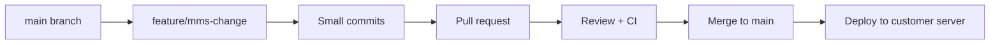
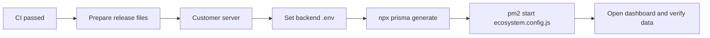

# Git and DevOps Workflow

## 1. Git Workflow



Recommended branch names:

- `feature/dashboard-report`
- `feature/machine-status`
- `fix/oee-calculation`
- `chore/deploy-config`

Recommended commit style:

- `feat: add monthly dashboard summary`
- `fix: correct OEE quality calculation`
- `docs: add deployment guide`
- `test: cover report aggregation`

## 2. CI Pipeline

```mermaid
flowchart LR
  Push["git push"] --> CI["GitHub Actions"]
  CI --> InstallBE["npm ci: backend"]
  InstallBE --> Prisma["npm run prisma:generate"]
  Prisma --> LintBE["npm run lint"]
  LintBE --> Test["backend unit tests"]
  Test --> Sim["simulator tests"]
  Sim --> Smoke["backend smoke test"]
  Smoke --> InstallFE["npm ci: fontend"]
  InstallFE --> LintFE["frontend lint"]
  LintFE --> Build["frontend production build"]
  Build --> Result["Pass / fail result"]
```



The current CI workflow runs:

- Backend dependency install.
- Prisma Client generation.
- Backend syntax check.
- Backend unit tests for OEE, output, report, simulator, MQTT, auto NG, and display rules.
- Backend smoke test for `/api/health`.
- Frontend dependency install.
- Frontend lint.
- Frontend production build.

## 3. CD and PM2 Deployment



Production commands:

```bash
cd MMS_project
cd backend
npm ci --omit=dev
npx prisma generate
cd ../fontend
npm ci
npm run build
cd ..
pm2 start ecosystem.config.js
pm2 save
```

For a repeat deployment after the PM2 process already exists:

```bash
git pull
cd backend
npm ci --omit=dev
npx prisma generate
cd ../fontend
npm ci
npm run build
cd ..
pm2 restart mms-dashboard-api --update-env
pm2 save
```

## 4. Release Checklist

- Unit tests pass.
- Frontend build succeeds.
- `.env` exists on customer server and is not committed.
- SQL Server is reachable from the backend server.
- MQTT/Influx source is reachable from the backend server.
- PM2 process is online.
- Daily and monthly report pages return expected data.
