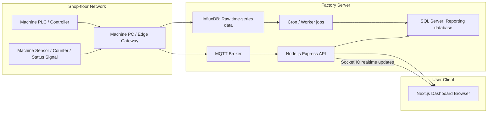
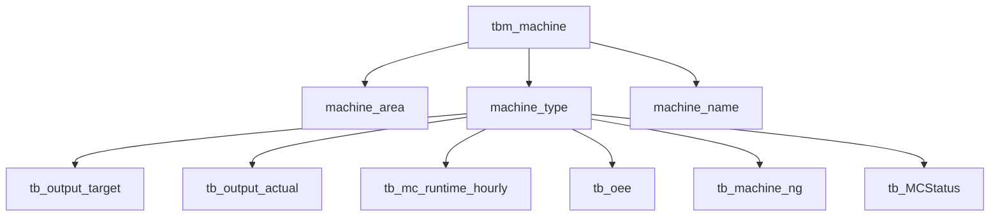
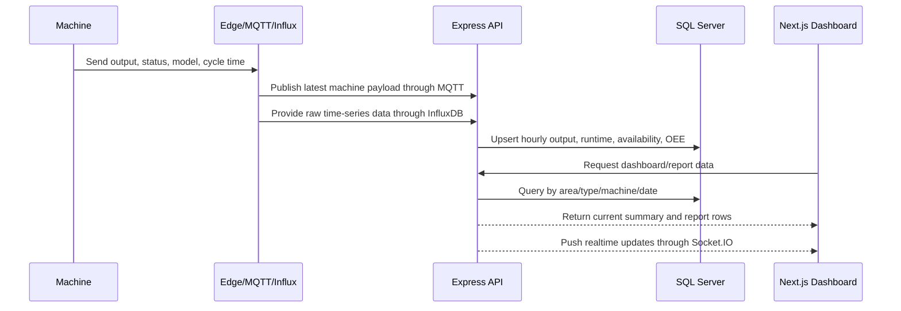
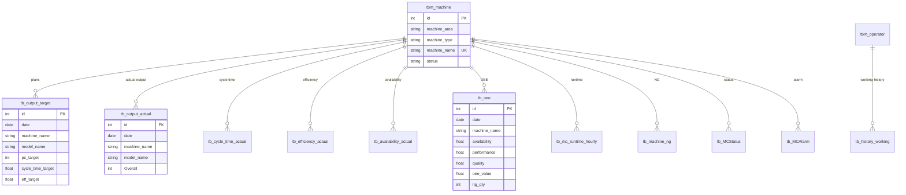
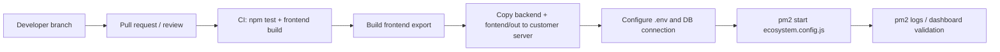

# System Architecture: Smart Factory MMS Dashboard

## 1. High-level Network Flow

## 2. Data Separation by Machine Type

Machine master data is separated by `machine_area`, `machine_type`, and `machine_name`. Reports can query by area, type, or individual machine.

## 3. Program Flow

## 4. ER Diagram

## 5. API Specification

| Area | Endpoint | Purpose |
| --- | --- | --- |
| Machine master | `GET /api/machine/listArea` | List active areas |
| Machine master | `GET /api/machine/listType/:area` | List machine types by area |
| Machine master | `GET /api/machine/listMachines/:area/:type` | List machines by area and type |
| Machine master | `GET /api/machine/listAllMachinesByArea` | Group active machines by area |
| OEE realtime | `GET /api/oee/getLastOEE` | Latest OEE records |
| OEE realtime | `GET /api/oee/getDataTable` | Main dashboard table data |
| OEE realtime | `GET /api/oee/getGraph1` | Dashboard graph data |
| OEE realtime | `GET /api/oee/getGraph2` | Dashboard graph data |
| Report | `GET /api/report/daily-dashboard` | Daily summary dashboard |
| Report | `GET /api/report/monthly-dashboard` | Monthly summary dashboard |
| Report | `GET /api/report/machine-report` | Machine-level production report |
| Report | `GET /api/report/machine-ng-report` | Machine NG report |
| Plan config | `GET /api/planConfig/list` | List machine plan configs |
| Plan config | `POST /api/planConfig/upsert` | Create or update plan config |
| Target | `POST /api/outputTarget/createOutputTargetRange` | Create target plan range |
| Machine status | `GET /api/mcstatus/timeline` | Machine status timeline |
| Machine status | `GET /api/mcstatus/latest-all` | Latest status by machine |

## 6. Tech Stack

| Layer | Technology |
| --- | --- |
| Frontend | Next.js 16, React 19, Bootstrap, AdminLTE, Chart.js |
| Backend | Node.js, Express 5, Socket.IO |
| Database ORM | Prisma |
| Main Database | SQL Server |
| Realtime/raw data | MQTT, InfluxDB |
| Process manager | PM2 |
| Testing | Node assert-based unit tests |
| CI/CD | GitHub Actions |

## 7. Deployment Flow

