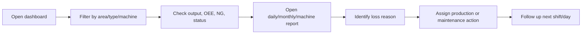

# User Manual: Smart Factory MMS Dashboard

## 1. Open the Dashboard

1. Open the dashboard URL from the factory network.
2. Confirm the backend server is running through PM2.
3. Select the target area, machine type, or machine name.

## 2. Main Dashboard

Use the main dashboard to check current production condition.

- Machine status: running, stop, alarm, maintenance, or other configured states.
- Output and target: compares actual production against plan.
- OEE: combines availability, performance, and quality.
- NG: shows reject quantity and quality impact.

## 3. Daily Report

1. Open the Daily Dashboard page.
2. Select date, area, type, and machine filter.
3. Review output target per day, actual output, OEE, downtime, and alarm summary.
4. Use the report to identify which machine or type lost output during the selected day.

## 4. Monthly Report

1. Open the Monthly Dashboard page.
2. Select month range and filter.
3. Review month-by-month output and OEE trend.
4. Compare monthly performance before and after improvement actions.

## 5. Production Plan and Target

1. Open production plan or output target configuration.
2. Select machine and date range.
3. Enter target output, cycle time target, efficiency target, model, process, and working hours.
4. Save the plan.
5. Reopen dashboard/report pages to verify the target is applied.

## 6. OEE Update and NG Flow

1. Open the OEE update page.
2. Select area and machine type.
3. Review actual output, auto NG quantity, availability, performance, quality, and OEE.
4. NG is calculated from machine data automatically; no manual NG entry is required.
5. Confirm the realtime values match the machine condition.

## 7. Machine Status Timeline

1. Open machine status or timeline page.
2. Select target machine and date/time range.
3. Review status segments such as run, stop, alarm, maintenance, adjustment, or planned stop.
4. Use the timeline to identify downtime root cause.

## 8. Production Review Workflow

## 9. Troubleshooting

| Symptom | Check |
| --- | --- |
| Dashboard has no data | Check backend PM2 status, SQL Server connection, and `DATABASE_URL` |
| Machine status not updating | Check MQTT broker, InfluxDB, machine network, and worker logs |
| Frontend cannot call API | Check backend port, reverse proxy, CORS, and frontend `apiServer` config |
| PM2 process restarts | Check `backend/logs/pm2-error.log` and memory usage |
| Report number looks wrong | Check target plan, machine filter, date range, and source table consistency |
